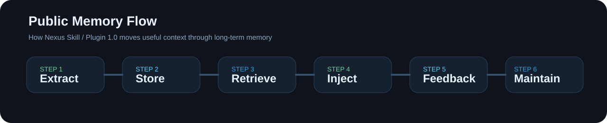
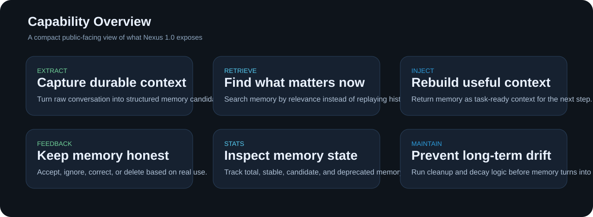

<div align="center">
  
</div>

> This is a Vibe Coding project: Built with AI, for AI-augmented development.


**English** | [中文](README.md)

## What Nexus Is

`Nexus Skill / Plugin 1.0` is a long-term memory skill for agent hosts.

It should not be framed as a separate core runtime project that forces every user to bootstrap a fixed local model stack. The intended shape is:

> drop it into a host-discoverable Skill / Plugin directory  
> let the host decide when memory is needed  
> let Nexus handle extraction, retrieval, injection, feedback, maintenance, and Markdown projection

The current public workflow is:

`extract -> store -> search -> inject -> feedback -> stats -> maintain -> projection export/import`

## Core Capabilities

<div align="center">
  
</div>

Nexus 1.0 exposes eight public capabilities:

1. `extract`
   Pull durable memories out of conversations, task context, and document fragments.
2. `search`
   Retrieve relevant memories when a new task begins.
3. `inject`
   Turn relevant memories into context that can be fed back into the current workflow.
4. `feedback`
   Accept, ignore, correct, or delete memories based on real usage.
5. `stats`
   Inspect memory volume and state.
6. `maintain`
   Keep the memory base healthy over time.
7. `projection export`
   Export local memories into editable Markdown files.
8. `projection import`
   Re-import edited Markdown files back into the memory store.

<div align="center">
  
</div>

## Installation And Integration

### 1. Install As A Skill

The primary installation shape for Nexus 1.0 is:

1. download the repository
2. place it in the host's discoverable Skill / Plugin directory
3. let the host read `SKILL.md`

The main files most hosts need are:

- `SKILL.md`
- `config/nexus.json`
- `src/nexus/`
- `adapters/skill_entry.py`

### 2. Minimal Configuration

Edit [config/nexus.json](config/nexus.json):

```json
{
  "db_path": "data/nexus.db",
  "log_level": "INFO"
}
```

This minimal config only expresses:

- where the memory database lives
- what log level to use

That matches the public boundary of a Skill. It does not turn a specific local model stack into a product requirement.

### 3. When The Host Already Provides LLM Capabilities

If the host already provides model access, Nexus should reuse the host.

That means:

- users should not be required to install Ollama
- `qwen3:4b` should not be treated as a product default
- users should not be required to install a separate embedding model

For Codex, Claude Code, Hermes, and similar environments, the intended framing is: **host first, Nexus reuses the host**.

### 4. Local Or Remote Backends Are Optional Adapters

When a host does not provide model backends, the integrator can attach an optional backend such as:

- local Ollama
- an OpenAI-compatible API
- another model service injected by the host

Those are supported integration choices, not the default requirement of Nexus Skill 1.0.

## How Agent Hosts Should Use It

### Codex-like hosts

Place this repository in a discoverable Skill / Plugin directory, let the host read `SKILL.md`, and call the Nexus entry point when long-term memory is needed.

### Claude Code-like hosts

Mount Nexus as a long-term memory skill and trigger `extract / search / inject / feedback / stats / maintain / projection` at the appropriate workflow steps.

### Hermes-like hosts

Integrate Nexus as an external long-term memory plugin and let Hermes decide when to trigger extraction, retrieval, injection, feedback, and Markdown projection import/export.

## Public Entry Points

The current Skill 1.0 entry surface is:

- `SKILL.md`
- `adapters/skill_entry.py`
- `src/nexus/skill_entry.py`
- `src/nexus/cli.py`

The current stable public objects are:

- `MemoryCoprocessor`
- `Config`
- `MemoryRecord`
- `MemoryType`
- `MemoryStatus`
- `ScoredMemory`
- `ProjectionConfig`
- `ProjectionMode`
- `MemoryRiskLevel`

## Markdown Projection Layer

1. `projection export`
   Export current memories into local Markdown files.
2. `projection import`
   Import edited Markdown files back into the local memory store.

Skill 1.0 intentionally uses a looser user-side policy here:

- user-visible
- user-editable
- user-correctable through re-import
- not inheriting the stricter Core governance defaults

## Quick Example

The public example lives at [examples/quickstart_1_0.py](examples/quickstart_1_0.py).

It demonstrates the Skill 1.0 workflow across:

- extract
- search
- inject
- feedback
- stats
- projection export
- projection import

The example uses mock components so the workflow can be verified without forcing a fixed local model stack.

## What Is Not Included

The following are not part of the current 1.0 primary public surface:

- `exchange`
- `host adapter / host runner / event runner`
- `host events / host contract`
- `service`
- host example scripts
- protocol preacceptance scripts
- `tests`
- `lab`

The old `anchor / compress / guard / pipeline / ruleforge` line is retained only as historical material, not as the public main interface.

## Relationship To Nexus Core

Nexus Skill / Plugin 1.0 is built on the stable `Nexus Core 1.0` memory facade, but this repository presents a Skill-first public surface rather than internal Core development structure.

The public goal is simple: make long-term memory understandable, installable, and usable as a single Skill.

## Toward 2.0

Future `2.0` work can expand the public surface, but it is intentionally out of scope for the current release:

- broader host integration
- more stable long-running memory workflows
- clearer plugin-style installation
- stronger cross-environment collaboration

## License

MIT
