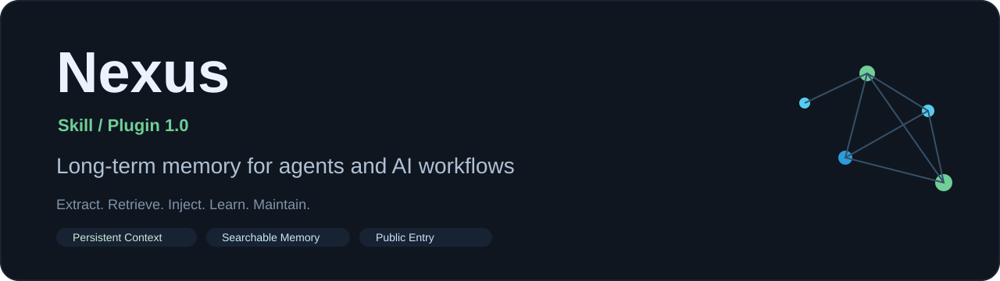
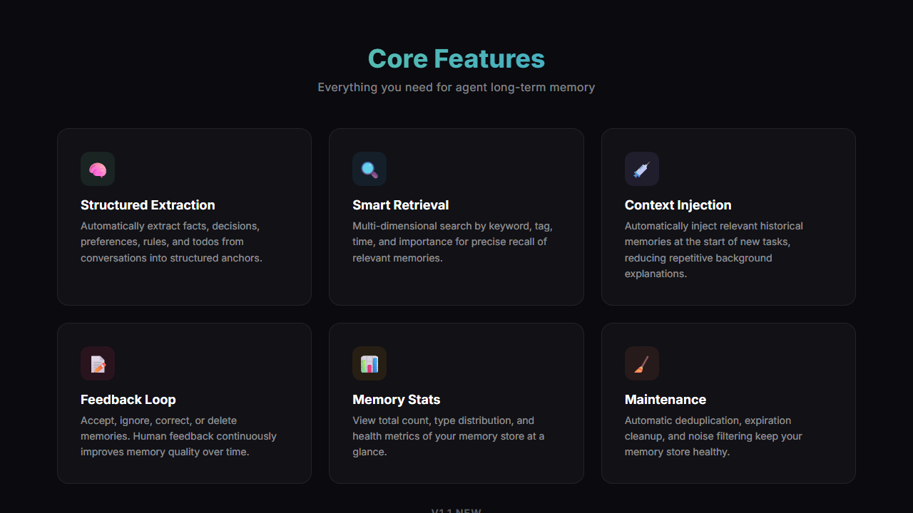
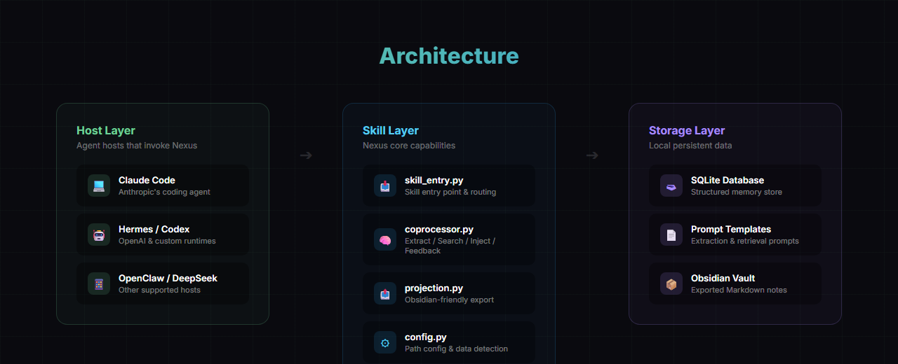
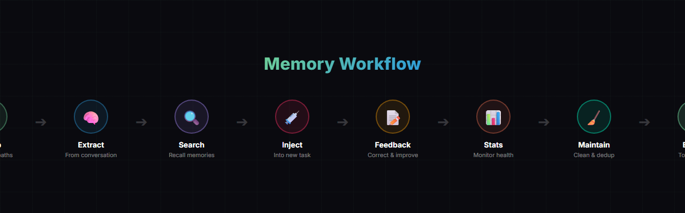

<div align="center">
  
</div>

> 🧠 This is a **Vibe Coding** project: Built with AI, for AI-augmented development.


**English** | [中文](README.md)

**Nexus** is a long-term memory Skill for agent hosts — giving AI assistants persistent memory across conversations.

Its core value: **let agents automatically bring back previous decisions, preferences, and context in every new conversation, so users never have to repeat background information.**

---

<p align="center">
  
</p>

## ✨ Features

### Core Capabilities

| Feature | Description |
|---------|-------------|
| 🧠 **Structured Memory Extraction** | Automatically extract facts, decisions, preferences, rules, and todos from conversations into structured anchors |
| 🔍 **Smart Memory Retrieval** | Multi-dimensional search by keyword, tag, time, and importance for precise recall |
| 💉 **Pre-Task Context Injection** | Automatically inject relevant historical memories at the start of new tasks |
| 📝 **Human Feedback Loop** | Accept, ignore, correct, or delete memories to continuously improve quality |
| 📊 **Memory Stats** | View total count, type distribution, and health of your memory store |
| 🧹 **Maintenance & Cleanup** | Automatic deduplication, expiration, and noise filtering |

### v1.1 New

| Feature | Description |
|---------|-------------|
| 📤 **Obsidian Export** | Export memory store as Markdown files, ready to browse in Obsidian |
| ⚙️ **First-Run Path Setup** | Configure database and Obsidian export paths on first install |
| 🔎 **Existing Data Detection** | Auto-detect existing databases or export directories, with reuse support |
| 🔗 **Local Multi-Agent Sharing** | Multiple agents (Hermes / Codex / Claude Code etc.) can share one memory store |

---

<p align="center">
  
</p>

## 🏗️ Architecture

```
Nexus/
├── src/nexus/           # 🧠 Core modules
│   ├── coprocessor.py   #   Memory coprocessor (extract/search/inject/feedback)
│   ├── config.py        #   Config management (db_path / obsidian_root_path)
│   ├── prompts/         #   Extraction & retrieval prompt templates
│   └── schema.sql       #   SQLite database schema
├── adapters/            # 🔌 Host adapter layer
│   └── skill_entry.py   #   Skill entry point (for host invocation)
├── config/              # ⚙️ Configuration
│   └── nexus.json       #   Default config
├── data/                # 💾 Runtime data (SQLite database)
├── scripts/             # 🛠️ Helper scripts
├── tests/               # 🧪 Tests
├── install.sh           # 📦 One-click install script
└── SKILL.md             # Agent skill description
```

---

<p align="center">
  
</p>

## 🚀 Quick Start

Nexus is an AI skill (Skill). After installation, use it directly in conversation. **Just tell the AI what you want in natural language.**

### Installation

Pick the command for your host and run it in the terminal:

### Claude Code

```bash
git clone https://github.com/kialajin-l/Nexus.git && cd Nexus && ./install.sh claude-code
```

### Codex

```bash
git clone https://github.com/kialajin-l/Nexus.git && cd Nexus && ./install.sh codex
```

### Hermes

```bash
git clone https://github.com/kialajin-l/Nexus.git && cd Nexus && ./install.sh hermes
```

### OpenClaw

```bash
git clone https://github.com/kialajin-l/Nexus.git && cd Nexus && ./install.sh openclaw
```

### DeepSeek TUI

```bash
git clone https://github.com/kialajin-l/Nexus.git && cd Nexus && ./install.sh deepseek
```

If the one-click command doesn't work, install manually: clone the repo → enter the directory → run `./install.sh <host>`

### First-Time Setup

After installation, confirm two paths:

1. **SQLite database path** (where memories are stored)
2. **Obsidian export path** (optional, for exporting memories as Markdown notes)

Default config file is at: `config/nexus.json`

---

## 💬 Usage Examples

### Remember Information

> "Remember this preference: I prefer dark themes"
> "Save this decision: use SQLite, not PostgreSQL"
> "Save this rule: write code comments in Chinese"

### Search Past Memories

> "Check what I said about database selection before"
> "Search for past decisions about deployment"
> "See if there are any related preferences"

### Reference Memories in Current Tasks

> "Reference previous rules before writing code"
> "Bring relevant memories into this task"

### Correct or Delete Memories

> "This memory is wrong, fix it"
> "Ignore this memory"
> "Delete this outdated memory"

### Export to Obsidian

> "Export memories as Markdown"
> "Export to Obsidian vault"

### View Memory Stats

> "Show me how many memories are stored"
> "Check the long-term memory status"

### Maintain Memory Store

> "Clean up the memory store"
> "Do a memory maintenance pass"

---

## 📖 Quick Reference

| Scenario | What to Say |
|----------|-------------|
| **Setup & Init** | Configure Nexus, set database path, set Obsidian path, check for existing memory store, reuse previous database |
| **Remember Info** | Remember this preference, save this decision, save this rule, extract long-term memory from this conversation |
| **Search Memories** | Check what I said before, search for past decisions about X, find previous preferences, see if there are related memories |
| **Reference Memories** | Reference previous rules, bring relevant memories into this task, add previous decisions to current task |
| **Correct or Delete** | This memory is wrong, ignore this, fix this memory, delete this memory |
| **View Stats** | Show memory store status, count total memories, check long-term memory health |
| **Maintenance** | Clean up memory store, do memory maintenance, clear old memories |
| **Export to Obsidian** | Export to Obsidian, export memories as Markdown, generate Obsidian-compatible memory files |

---

## 🔗 Local Multi-Agent Sharing

Nexus 1.1 supports multiple local agents sharing one long-term memory store, but it's not automatic.

**How to share:** Point multiple hosts to the same `db_path`.

```json
// config/nexus.json
{
  "db_path": "D:\shared\nexus\nexus.db"
}
```

- By default, each agent has its own private store
- To share, explicitly configure the same database path
- For shared export notes, also unify `obsidian_root_path`

---

## 🗺️ Roadmap

### v1.0 ✅ — MVP Core
- [x] Structured memory extraction (facts/decisions/preferences/rules/todos)
- [x] Local SQLite storage
- [x] Multi-dimensional memory retrieval
- [x] Pre-task context injection
- [x] Human feedback loop (accept/ignore/correct/delete)
- [x] Memory maintenance & stats

### v1.1 ✅ — Obsidian Export + Multi-Agent Sharing
- [x] Obsidian-friendly Markdown export
- [x] First-run path setup & existing data detection
- [x] Local multi-agent sharing support

### v2.0 📋 — Cross-Device Memory Sharing
- [ ] Cross-device memory sync
- [ ] Community maintenance & shared data
- [ ] Knowledge pack import/export

---

## 🤝 Contributing

```bash
git clone https://github.com/kialajin-l/Nexus.git
cd Nexus
pip install -e ".[dev]"
pytest
```

---

## 📄 License

MIT License

## 🙏 Acknowledgments

- [Xiaomi miclaw](https://github.com/XiaomiMiClaw) — AI assistant platform
- [Mem0](https://github.com/mem0ai/mem0) — Memory layer design reference
- [Hermes](https://github.com/hermes-agent) — Agent runtime architecture reference
- [Obsidian](https://obsidian.md) — Knowledge management & export target

---

## 🌟 Star History

[](https://star-history.com/#kialajin-l/Nexus&Date)
